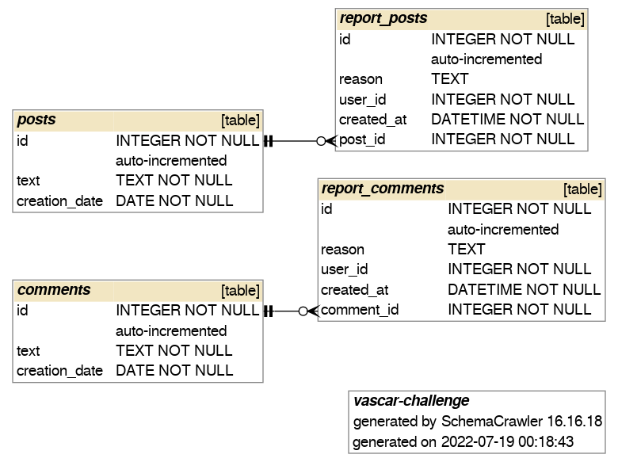

# Challenge-vascar
Coding challange for vascar solutions
### Description:

### An application has a social posts and comments feature. Both, posts and comments can be reported by users. The report needs to store,

·         A reason why the user reported it (free text)

·         The user who reported it (a user id, for the purpose of this practice program just a random integer)

·         The date when the report was made

### Posts and comments are very simple, they just store

·         A unique identifier (integer)

·         A text field (free text limited to 500 characters)

·         The post/comment creation date

### Write a simple application that reads comments from a sqlite database and writes these reports back to it through a REST API. You will only need 2 endpoints, namely the one for reporting comments and the one for reporting posts. You will also need to write simple end-to-end tests using the native Go testing utilities.

# Solution
To start the application in the *localhost:8080* , you have 2 ways:
*Local build:*
 - You will need Go v1.18 installed.
*Docker:*
 - You will need Docker installed.

Either way, you need to clone the repository first, to do that:

> `git clone https://github.com/naldeco98/challenge-vascar.git`

## **Running local**:
You need to run the following commands:
Get al dependencies:

> `go mod download`

Then you can run the functional test with:
> `go test ./test -v`

If the all test passed, you can start the server with the following command:

> `go run cmd/main.go`

## **Running in local Docker container**:
You need to run the following commands:

First build the image from the docker file

> `docker build --tag vascar-challenge .`

This will create the new image and also run the functional test.

If the all test passed, you can start the server with the following command:

> `docker run -p 8080:8080 vascar-challenge .`

## Endpoints:
Documentation in swagger
 - `GET http://localhost:8080/docs/index.html` 
   
Create a report for a post
 - `POST http://localhost:8080/docs/reports/comments` 
  
*body example:*
```
  {
    "reason": "bad attitude",
    "user_id": 1,
    "comment_id": 1
  }
```  
Create a report for a post
 - `POST http://localhost:8080/reports/posts` 

*body example:*
```
  {
    "reason": "bad attitude",
    "user_id": 1,
    "post_id": 1
  }
```

## Database
The database is composed of 4 tables (comments, posts, report_comments and report_posts) the *posts* & *comments* have mock updata for testing purposes.

Here they ware with their respective DDL statement:
 - posts
  ```
  CREATE TABLE comments (
    id INTEGER NOT NULL UNIQUE,
    text TEXT NOT NULL,
    creation_date DATE NOT NULL DEFAULT CURRENT_TIMESTAMP,
    PRIMARY KEY (id) AUTOINCREMENT);
  ```
 - report_posts
```
    CREATE TABLE report_comments (
        id INTEGER NOT NULL UNIQUE,
        reason TEXT,
        user_id INTEGER NOT NULL,
        created_at DATETIME NOT NULL DEFAULT CURRENT_TIMESTAMP,
        comment_id INTEGER NOT NULL,
        FOREIGN KEY (comment_id) REFERENCES comments (id), PRIMARY KEY (id) AUTOINCREMENT);
```
 - comments
```
    CREATE TABLE comments (
        id INTEGER NOT NULL UNIQUE,
        text TEXT NOT NULL,
        creation_date DATE NOT NULL DEFAULT CURRENT_TIMESTAMP,
        PRIMARY KEY (id) AUTOINCREMENT);
```
 - report_comments
```
    CREATE TABLE report_comments (
        id INTEGER NOT NULL UNIQUE,
        reason TEXT,
        user_id INTEGER NOT NULL,
        created_at DATETIME NOT NULL DEFAULT CURRENT_TIMESTAMP,
        comment_id INTEGER NOT NULL,
        FOREIGN KEY (comment_id) REFERENCES comments (id), PRIMARY KEY (id) AUTOINCREMENT);
```
### **Entity–Relationship Model:**
